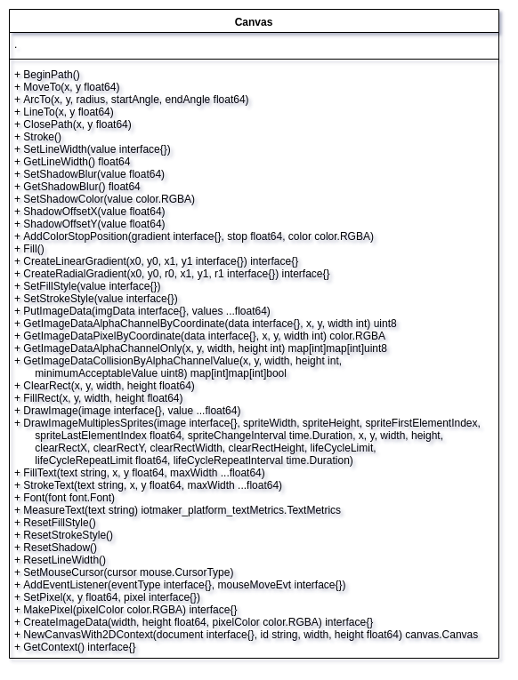

# iotmaker.webassembly.platform



Experimental webassembly framework / Framework webassembly experimental

``` golang

// +build js

package main

import (
	"github.com/helmutkemper/iotmaker.platform.webbrowser/factoryBrowserDocument"
	"github.com/helmutkemper/iotmaker.platform.webbrowser/factoryBrowserHtml"
)

func main() {

	done := make(chan struct{}, 0)

	browserDocument := factoryBrowserDocument.NewDocument()

	factoryBrowserHtml.NewImage(
		browserDocument.SelfDocument,
		map[string]interface{}{
			"id":  "player",
			"src": "./player_big.png",
		},
		true,
		true,
	)

	<-done
}
 
``` 


