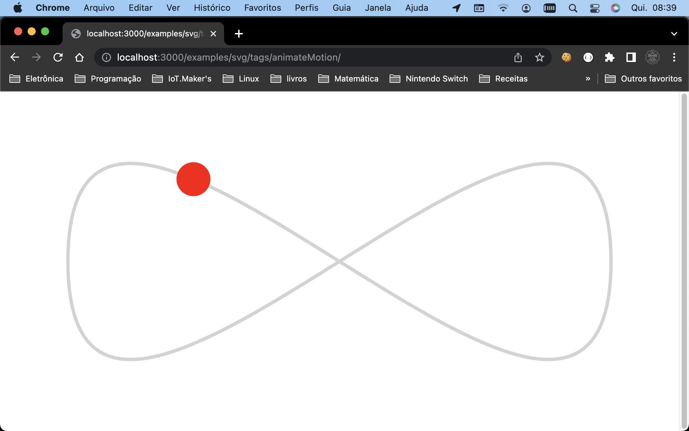
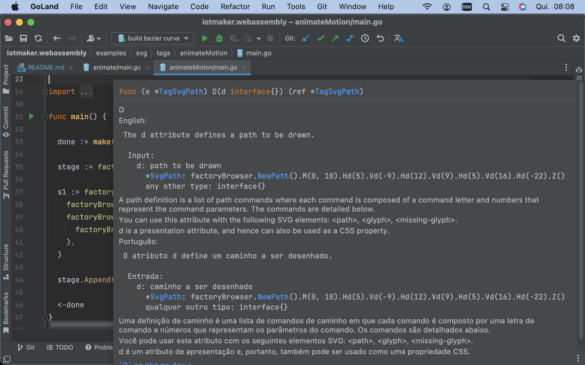

# iotmaker webassembly

### In development phase. 

> Use at your own risk.

Why do? / Por quê fazer?

> WebAssembly is a new type of code that can be run in modern web browsers — it is a low-level assembly-like language with a compact binary format that runs with near-native performance and provides languages such as C/C++, C# and Rust with a compilation target so that they can run on the web. It is also designed to run alongside JavaScript, allowing both to work together.

#### English:

This project is porting documentation from developer.mozilla.org into Golang and many of the examples are taken from it.

Now, there are more than [140 examples](examples/svg/attributes) of how to use svg tags and more than [50 examples](examples/svg/tags) of how to use their properties.

#### Português:

Este projeto está portando a documentação do site developer.mozilla.org para dentro do Golang e muitos dos exemplos foram tirados dele.

No momento, são mais de [140 exemplos](examples/svg/attributes) de como usar as tags svg e mais de [50 exemplos](examples/svg/tags) de como usar as suas propriedades.

### Instructions/Instruções:

How to turn on the local server: / Como ligar o servidor local:
```shell
  cd examples/server
  make build
```

To see what the documentation will be: / Para ver o que será a documentação:
```
http://localhost:3000
```

To see the stable examples for use: / Para ver os exemplos estáveis para uso:
```
http://localhost:3000/examples/svg/
```

### Example of use / Exemplo de uso

**Reference/Referência:**

[https://developer.mozilla.org/en-US/docs/Web/SVG/Element/animateMotion](https://developer.mozilla.org/en-US/docs/Web/SVG/Element/animateMotion)

**HTML**
```html
<svg viewBox="0 0 200 100" xmlns="http://www.w3.org/2000/svg">
  <path fill="none" stroke="lightgrey"
    d="M20,50 C20,-50 180,150 180,50 C180-50 20,150 20,50 z" />

  <circle r="5" fill="red">
    <animateMotion dur="10s" repeatCount="indefinite"
      path="M20,50 C20,-50 180,150 180,50 C180-50 20,150 20,50 z" />
  </circle>
</svg>
```

**Golang**
```go
//go:build js
// +build js

package main

import (
  "github.com/helmutkemper/iotmaker.webassembly/browser/factoryBrowser"
  "github.com/helmutkemper/iotmaker.webassembly/browser/html"
  "github.com/helmutkemper/iotmaker.webassembly/platform/factoryColor"
  "time"
)

func main() {

  done := make(chan struct{}, 0)

  stage := factoryBrowser.NewStage()

  s1 := factoryBrowser.NewTagSvg().ViewBox([]float64{0, 0, 200, 100}).Append(
    factoryBrowser.NewTagSvgPath().Fill(nil).Stroke(factoryColor.NewLightgrey()).D(factoryBrowser.NewPath().M(20, 50).C(20, -50, 180, 150, 180, 50).C(180, -50, 20, 150, 20, 50).Z()),
    factoryBrowser.NewTagSvgCircle().R(5).Fill(factoryColor.NewRed()).Append(
      factoryBrowser.NewTagSvgAnimateMotion().Dur(10*time.Second).RepeatCount(html.KSvgDurIndefinite).Path(factoryBrowser.NewPath().M(20, 50).C(20, -50, 180, 150, 180, 50).C(180, -50, 20, 150, 20, 50).Z()),
    ),
  )

  stage.Append(s1)

  <-done
}
```

Browser: / Navegador:



How to generate binary file: / Como gerar o arquivo binário

```shell
  cd examples/svg/tags/animateMotion
  make build
```

### Documentation/Documentação


#### English:
While the current documentation site is not ready, use the in-code documentation. It was written in English and Portuguese.

#### Português:
Enquanto o site de documentação atual não fica pronta, use a documentação embutida no código. Ela foi escrita em inglês e em português.



## Golnag JS Tips

### How to create a new `js.Value{}`:
```go
newObject := js.Global().Get("Object")
newArray  := js.Global().Get("Array")

test := js.Global().Get("Object")
test.Set("test", "I'm alive!")
log.Printf("test: %v", test.Get("test"))
```

### How to create a callback (of hell) function:

Javascript Example:
```javascript
const options = {
  enableHighAccuracy: true,
  timeout: 5000,
  maximumAge: 0
};

function success(pos) {
  const crd = pos.coords;

  console.log('Your current position is:');
  console.log(`Latitude : ${crd.latitude}`);
  console.log(`Longitude: ${crd.longitude}`);
  console.log(`More or less ${crd.accuracy} meters.`);
}

function error(err) {
  console.warn(`ERROR(${err.code}): ${err.message}`);
}

navigator.geolocation.getCurrentPosition(success, error, options);
```

Function success, javascript:
```javascript
function success(pos) {
  const crd = pos.coords;

  console.log('Your current position is:');
  console.log(`Latitude : ${crd.latitude}`);
  console.log(`Longitude: ${crd.longitude}`);
  console.log(`More or less ${crd.accuracy} meters.`);
}
```

Function success, golang:
```go
var success = js.FuncOf(func(this js.Value, args []js.Value) interface{} {
  // javascript `pos` is golang `args[0]`
  var crd = args[0].Get("coords")
  
  log.Printf("Your current position is:")
  log.Printf("Latitude $v:", crd.Get("latitude"))
  log.Printf("Longitude $v:", crd.Get("longitude"))
  log.Printf("More or less $v meters", crd.Get("accuracy"))
  return nil
})
```

Function error, javascript:
```javascript
function error(err) {
  console.warn(`ERROR(${err.code}): ${err.message}`);
}
```

Function error, golang:
```go
var err = js.FuncOf(func(this js.Value, args []js.Value) interface{} {
  // javascript `err` is golang `args[0]`
  log.Printf("ERROR(%v): %v", args[0].Get("code"), args[0].Get("message")) 
})
```

Javascript options:
```javascript
const options = {
  enableHighAccuracy: true,
  timeout: 5000,
  maximumAge: 0
};
```

Javascript options, golang:
```go
var options = js.Global().Get("Object")
options.Set("enableHighAccuracy", true)
options.Set("timeout", 5000)
options.Set("maximumAge", 0)
```

Complete golang function:
```go
var options = js.Global().Get("Object")
options.Set("enableHighAccuracy", true)
options.Set("timeout", 5000)
options.Set("maximumAge", 0)

var success = js.FuncOf(func(this js.Value, args []js.Value) interface{} {
  // javascript `pos` is golang `args[0]`
  var crd = args[0].Get("coords")

  log.Printf("Your current position is:")
  log.Printf("Latitude $v:", crd.Get("latitude"))
  log.Printf("Longitude $v:", crd.Get("longitude"))
  log.Printf("More or less $v meters", crd.Get("accuracy"))
  return nil
})

var err = js.FuncOf(func(this js.Value, args []js.Value) interface{} {
  // javascript `err` is golang `args[0]`
  log.Printf("ERROR(%v): %v", args[0].Get("code"), args[0].Get("message"))
})

js.Global().Get("navigator").Get("geolocation").Call("getCurrentPosition", success, err, options)
```

### How to get a promise, real example:
```go
type Data struct {
  DeviceId string
  GroupId  string
  Kind     string
  Label    string
}

list := make([]Data, 0)
end := make(chan struct{})

forEach := js.FuncOf(func(_ js.Value, args []js.Value) any {
  data := Data{
    DeviceId: args[0].Get("deviceId").String(),
    GroupId:  args[0].Get("groupId").String(),
    Kind:     args[0].Get("kind").String(),
    Label:    args[0].Get("label").String(),
  }
  list = append(list, data)
  return nil
})

var success = js.FuncOf(func(_ js.Value, args []js.Value) interface{} {
  // enumerateDevices() returns an array, but, go returns an object (bug)
  // call a forEach() for correct this problem.
  args[0].Call("forEach", forEach)
  end <- struct{}{}
  return nil
})

var failure = js.FuncOf(func(this js.Value, args []js.Value) interface{} {
  log.Printf("message: %v", args[0].Get("message"))
  return nil
})

// enumerateDevices() returns a promise
js.Global().Get("navigator").Get("mediaDevices").Call("enumerateDevices").Call("then", success, failure)
<-end
log.Printf("list: %+v", list)
```

### How to call javascript function:

Javascript:
```html
<script>
  window.test = function (a){
    console.log(a)
  }
</script>
```

Golang:
```go
js.Global().Call("test", value)
```

### How to use constructor

| Go                     | JavaScript  |
|------------------------|-------------|
| js.Value               | [its value] |
| js.Func                | function    |
| nil                    | null        |
| bool                   | boolean     |
| integers and floats    | number      |
| string                 | string      |
| []interface{}          | new array   |
| map[string]interface{} | new object  |

Javascript code:
```javascript
  var aFileParts = ['<a id="a"><b id="b">hey!</b></a>'];
  var oMyBlob = new Blob(aFileParts, {type : 'text/html'}); // o blob
```

Golang code:
```go
  done := make(chan struct{}, 0)
	
  // use native golang to work!
  b := js.Global().Get("Blob").New([]interface{}{"<a id=\"a\"><b id=\"b\">hey!</b></a>"}, map[string]interface{}{"type": "text/html"})
  log.Printf("%v", b.Get("size"))
  log.Printf("%v", b.Get("type"))
	
  <-done
```