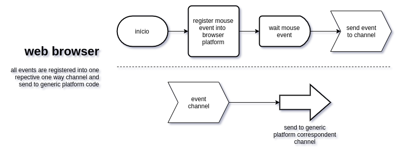

### Mouse event web browser

### Mouse event into web browser to generic platform

For engine, please, see [engine repository](https://github.com/helmutkemper/iotmaker.santa_isabel_theater.platform/tree/master/engine)

Este pacote contém as funções do mouse em relação ao navegador web. A ideia básica é garantir o 
isolamento dos módulos, convertendo o objeto js.Value em dados nativos do Golang.
