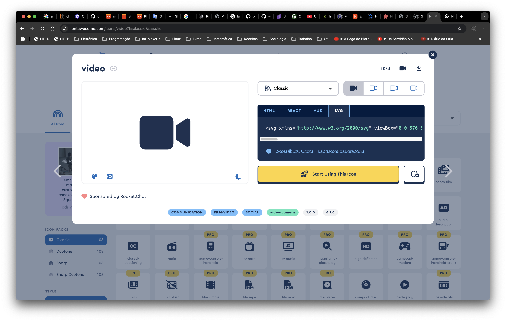

# Menu 

## Português

### Instruções de como fazer um ítem do menu

Entra no site [https://fontawesome.com](https://fontawesome.com) e escolha um ícone, por exemplo: 
[https://fontawesome.com/icons/video?f=classic&s=solid](https://fontawesome.com/icons/video?f=classic&s=solid)



Clique em **SVG** e copie a **tag svg** para seu editor, depois procure pelo `viewBox`, e caso ele seja diferente de 
`0 0 512 512`, o transforme em slice de int: `[]int{0, 0, 576, 512}`. 

Depois procure por `<path d="M0 128C0 92.7 28.7 64 64...` e transforme em constante. Apenas a `string` entre aspas.

Em seguida, monte uma função, ajustando os parâmetros de acordo com as suas necessidades

```go
func (e MakeIcon) GetUpload() (png js.Value) {
	return e.getIcon(
		data{
			label:       "Upload",
			path:        kFontAwesomeUpload,
		},
	)
}
```

Caso o `viewBox`seja diferente, monte-o como no exemplo abaixo:

```go
func (e MakeIcon) GetUpload() (png js.Value) {
	return e.getIcon(
		data{
			iconViewBox: []int{0, 0, 576, 512},
			label:       "Upload",
			path:        kFontAwesomeUpload,
		},
	)
}
```

Os valores opcionais e obrigatórios são:

```go
type data struct {
	iconX           rulesDensity.Density // [opcional]
	iconY           rulesDensity.Density // [opcional]
	iconWidth       rulesDensity.Density // [opcional]
	iconHeight      rulesDensity.Density // [opcional]
	iconViewBox     []int                // [opcional]
	label           string               // [obrigatório]
	labelFontSize   rulesDensity.Density // [opcional]
	labelY          rulesDensity.Density // [opcional]
	path            string               // [obrigatório]
	ColorIcon       color.RGBA           // [opcional]
	ColorBorder     color.RGBA           // [opcional]
	ColorLabel      color.RGBA           // [opcional]
	ColorBackground color.RGBA           // [opcional]
}
```
